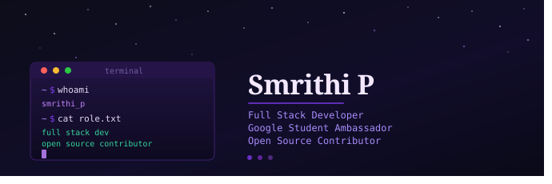

  

  
  
  
  

  

---

## About Me

Computer Science & Engineering student passionate about building products, contributing to open source, and exploring AI-powered experiences.

- Google Student Ambassador 2026
- Full Stack Developer
- Project Admin — Social Summer of Code 2026
- Open Source Contributor (SWOC & GSSoC, 2024 - Present)
- Exploring Agentic AI Engineering and Cloud Computing
- Hackathon Winner & Finalist at multiple hackathons
- Chess Enthusiast

---

## Tech Stack

### Languages

  

### Frontend

  

### Backend

  

### Databases

  

### Cloud & Tools

  

---

## GitHub Analytics

  
  

  

---

## Contribution Activity

  

---

## Profile Summary

  

---

  <i>Building useful software, learning continuously, and sharing the journey.</i>

